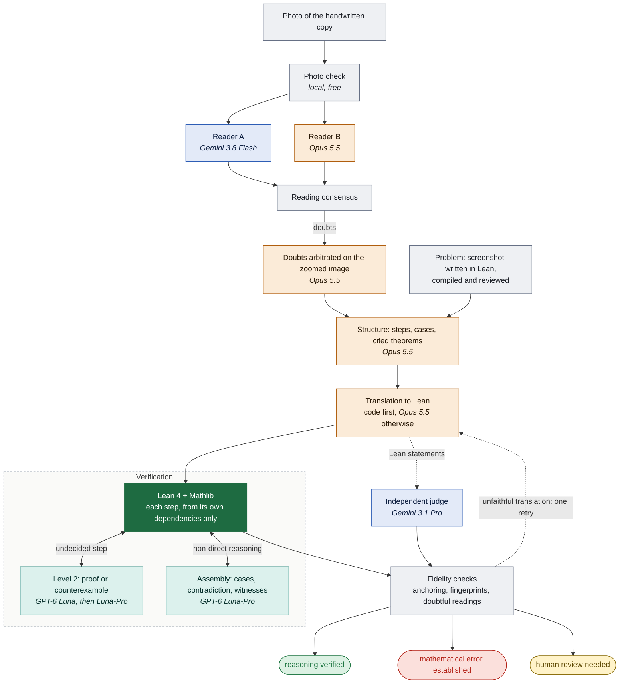
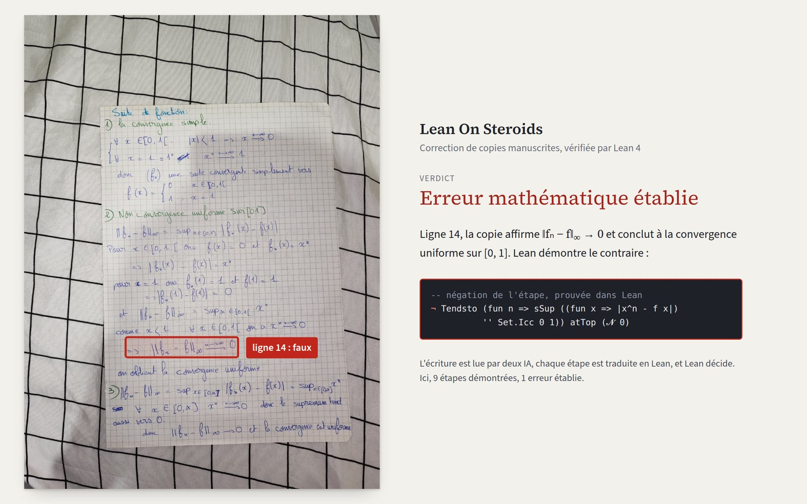
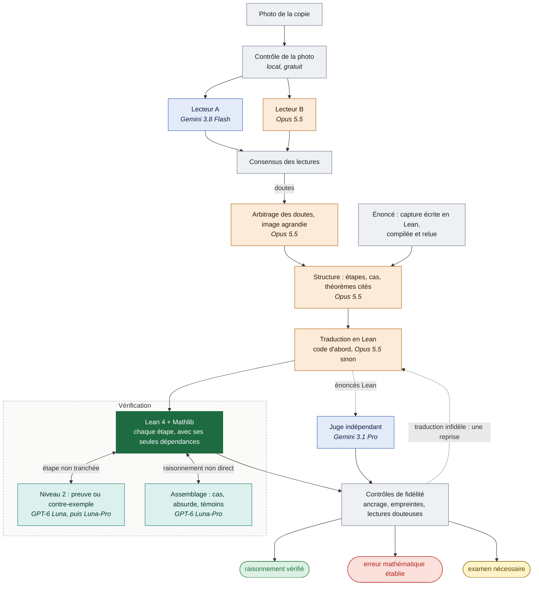

# Lean On Steroids

**[English](#english) · [Français](#français)**

## English

Handwritten math proofs, corrected and verified by Lean 4.

You photograph the problem, then the handwritten copy. Lean On Steroids reads the handwriting, splits the
reasoning into steps, translates each step into Lean 4 (Mathlib) and has Lean check it. The result is one of
three verdicts, with a teacher-style feedback in French.

### Why this project

Large language models read handwriting remarkably well and can follow an argument, but they
**hallucinate**: they approve a wrong proof with confidence, invent a justification the copy never gave,
or silently "fix" the student's mistake while reading it. Asking a chatbot "is my proof correct?" gives
an opinion, not a verification.

Lean 4 is the opposite: an **exact** proof checker. A step it accepts is proven, a step it refutes is
false, with no opinion and no approximation. But Lean cannot read a photo or understand a proof written
in natural language.

Lean On Steroids combines the two, and each one stays in its lane:

* AI models **read, structure and propose** (a reading, a translation, a proof);
* Lean **decides**: nothing is accepted because an AI says so, only because Lean checked it;
* fidelity checks stop the AI from changing what the student wrote.

The result is a **strict and accurate** correction: a weak or wrong AI can only add one more
"human review needed", never a false "reasoning verified".

### The three verdicts

| Verdict | Condition |
|---|---|
| **reasoning verified** (raisonnement vérifié) | every claim in the copy is proven in Lean from its own dependencies; the steps assemble into the problem statement; standard axioms only; fidelity checked; no blocking reading doubt |
| **mathematical error established** (erreur mathématique établie) | Lean proves that a step is false (counterexample), under all the hypotheses of its case, and both the reading and the translation of that line passed the checks |
| **human review needed** (examen nécessaire) | every other case: an unjustified hard step, an uncertain reading, a disputed translation. It is not an accusation |

Tolerant mode (default): a true step that only lacks an elementary justification is accepted, with a
"for a perfect write-up" note. A false step or a missing hard step never is.

### Web interface

```sh
git clone https://github.com/0x-type/lean_on_steroids.git && cd lean_on_steroids
pip install -e ".[dev]"
# Lean 4.34.1 and Mathlib: see lean_workspace/README.md
export OPENROUTER_API_KEY=...
leanonsteroids web                    # http://127.0.0.1:8000/
leanonsteroids web --hote 0.0.0.0 --port 8080   # exposed to the network, behind an HTTPS proxy
```

1. **The problem**: a screenshot or photo of any exercise. It is written in Lean, compiled by Lean (two
   retries on error), then reviewed against the image by a judge from another provider. If it fails either
   check it is not validated, and the correction cannot conclude "verified" or "error established". You can
   also pick a prepared exercise (`examples/collecte/exercices`) with its kit of course results.
2. **The copy**: photos of the pages, in order. Progress is shown stage by stage, then the verdict, the
   feedback and the full report.

Uploaded files go to `runs/web/`. The server uses only the Python standard library; at most two
corrections run at once, because Lean is heavy.

### Command line

```sh
leanonsteroids corriger --exercice examples/collecte/exercices/mw06.json --images copy.jpg --sortie runs/x
leanonsteroids demo          # sample copy and 4 variants, no API key needed
leanonsteroids photo copy.jpg   # local photo check, free
pytest                # 142 tests, including end-to-end cases with Lean
```

Any stage can be replaced by a file (`--transcription`, `--structure`, `--formalisation`): this is how a
teacher corrects a reading. All model calls are cached in `runs/.cache/` (exact replay, audit trail).

### Default model profile (M)

One key, OpenRouter. Profile M was chosen after comparisons on real copies:

| Stage | Model | Why |
|---|---|---|
| Reading (2 blind readers) | Gemini 3.8 Flash + Opus 5.5 | a reading error is the only one Lean cannot catch |
| Doubt arbitration | Opus 5.5 | looks at the zoomed image |
| Reasoning structure | Opus 5.5 | the cheaper models tested miss cases and witnesses |
| Translation to Lean | deterministic translator, then Opus 5.5 | must say exactly what the copy says |
| Level 2 (proof or counterexample) | GPT-6 Luna, then Luna-Pro | Lean checks every proposed proof |
| Assembly (cases, contradiction, witnesses) | GPT-6 Luna-Pro | logic only, checked by Lean |
| Judge (reviews the translation) | Gemini 3.1 Pro, medium effort | a different provider from the translator |

About $0.40 to $0.80 and 3 to 6 minutes per copy. Any engine given on the command line wins;
`--profil aucun` disables the profile.

### Architecture



Orange is Opus 5.5: the stages where a mistake would change the verdict without Lean noticing. Light green
is the cheaper models: they only propose, and Lean re-checks every proposal. Blue is Gemini.
Image: `docs/architecture_en.png`.

### Safeguards

* **Blind reading.** The readers do not see the problem statement: a model that knows what should be
  written often "reads" what should be written. The arbiter declares when it relies on meaning.
* **AI formalizes statements, not proofs.** Steps are proven by fixed automation; a proof proposed by an
  AI counts only if Lean accepts it, and only with results the copy is allowed to use.
* **Cited theorems.** A big theorem (IVT, Rolle, Bézout...) counts only if the copy names it; a catalogue
  of 12 theorems, each checked in Lean, maps them to Mathlib. A one-letter slip in an acronym ("TVA" for
  TVI) is accepted if Lean confirms the theorem is really used.
* **Honest refutation.** A step is declared false only under all the hypotheses of the case it sits in: a
  step that is true in its case is never accused.
* **Numeric fingerprint.** Both sides of an equality, evaluated in Lean and in the copy (SymPy), must match:
  a translation that silently corrects the student is caught mechanically.
* **Uncertain readings.** Every alternative reading is tested: if it changes the meaning of a step, it
  blocks the conclusion. A crossing-out is ignored only if it just adds a mark.
* **Sandboxed Lean.** Forbidden fragments filtered (sorry, axiom, native_decide...), axioms checked
  (`propext`, `Classical.choice`, `Quot.sound`), no network, time and memory limits.

### Example



A real handwritten copy on the uniform convergence of xⁿ. On line 14 the student concludes that the
convergence is uniform on [0,1]; Lean proves the negation of that step, so the verdict is
**mathematical error established**. The 9 other steps of the copy are proven by Lean.

In the first tests on real copies there was no false accusation and no false "verified".

### Files

```
src/leanonsteroids/
  pipeline.py, cli.py     orchestration, command line, model profiles
  web/                    web interface (server.py, index.html)
  stages/transcribe.py    multi-engine reading, consensus, arbitration
  stages/agents.py        structure, formalization, level 2, assembly, judge
  stages/exercise_from_image.py   problem read from a screenshot, compiled and reviewed
  stages/fidelity.py      fidelity checks; stages/latex2lean.py deterministic translation
  stages/verdict.py       rules of the three verdicts; stages/feedback.py feedback in French
  theoremes.py, data/     catalogue of citable theorems
  lean/                   policy, generator, sandbox, interpretation
  report/html.py          HTML report
lean_workspace/           Lake project (Lean 4.34.1, Mathlib v4.34.1)
examples/                 prepared exercises, demo copy
tests/                    142 tests
```

### Known limits

* A problem read from a screenshot has no kit: steps that need an uncited course result end up in "human
  review needed" more often than with a prepared exercise.
* The numeric fingerprint covers ℕ, ℤ, ℚ; for ℝ, fidelity relies on the judge's review.
* Only part of Mathlib is compiled; a statement that needs another module is refused with a clear message.

### Sources

* LeanTutor, step-by-step verification of student proofs in Lean: https://arxiv.org/html/2506.08321v2
* ProofFlow, formalization through a dependency graph: https://arxiv.org/abs/2510.15981
* Robustness of autoformalization (autoformalizers that cancel errors): https://arxiv.org/abs/2606.14867
* Automatic grading of handwritten university exams: https://arxiv.org/pdf/2603.00895

---

## Français

Correction de démonstrations mathématiques manuscrites, vérifiée par Lean 4.

On photographie l'énoncé, puis la copie. Lean On Steroids lit l'écriture, découpe le raisonnement en étapes,
traduit chaque étape en Lean 4 (Mathlib) et la fait vérifier par Lean. Le résultat est l'une de trois
issues, avec un retour de correcteur en français.

### Pourquoi ce projet

Les grands modèles de langage lisent très bien l'écriture manuscrite et comprennent un raisonnement,
mais ils **hallucinent** : ils valident une preuve fausse avec assurance, inventent une justification
absente de la copie, ou « corrigent » en silence l'erreur de l'élève en la lisant. Demander à un chatbot
« ma démonstration est-elle juste ? » donne une opinion, pas une vérification.

Lean 4 est l'inverse : un vérificateur de preuves **exact**. Une étape qu'il accepte est démontrée,
une étape qu'il réfute est fausse, sans avis ni approximation. Mais Lean ne sait pas lire une photo ni
comprendre une rédaction en français.

Lean On Steroids combine les deux, et chacun reste à sa place :

* les modèles d'IA **lisent, structurent et proposent** (une lecture, une traduction, une preuve) ;
* Lean **tranche** : rien n'est validé parce qu'une IA l'affirme, seulement parce que Lean l'a vérifié ;
* des contrôles de fidélité empêchent l'IA de modifier ce que l'élève a écrit.

Le résultat est une correction **stricte et précise** : une IA faible ou qui se trompe ne peut produire
qu'un « examen nécessaire » de plus, jamais un faux « raisonnement vérifié ».

### Les trois issues

| Issue | Condition |
|---|---|
| **raisonnement vérifié** | chaque affirmation de la copie est démontrée dans Lean à partir de ses seules dépendances ; les étapes s'assemblent en l'énoncé ; axiomes standard uniquement ; fidélité contrôlée ; aucune lecture douteuse bloquante |
| **erreur mathématique établie** | Lean démontre qu'une étape est fausse (contre-exemple), sous toutes les hypothèses de son cas, et la lecture comme la traduction de cette ligne sont contrôlées |
| **examen nécessaire** | tous les autres cas : un pas difficile non justifié, une lecture incertaine, une traduction contestée. Ce n'est pas une accusation |

Mode tolérant (par défaut) : une étape vraie à laquelle il ne manque qu'une justification élémentaire est
acceptée, avec une note « pour une rédaction parfaite ». Une étape fausse ou un pas difficile absent ne
le sont jamais.

### Interface web

```sh
git clone https://github.com/0x-type/lean_on_steroids.git && cd lean_on_steroids
pip install -e ".[dev]"
# Lean 4.34.1 et Mathlib : voir lean_workspace/README.md
export OPENROUTER_API_KEY=...
leanonsteroids web                    # http://127.0.0.1:8000/
leanonsteroids web --hote 0.0.0.0 --port 8080   # exposée au réseau, derrière un proxy HTTPS
```

1. **L'énoncé** : une capture d'écran ou une photo de n'importe quel exercice. Il est écrit en Lean,
   compilé par Lean (deux reprises en cas d'erreur), puis relu avec l'image par un juge d'un autre
   fournisseur. S'il ne passe pas ces deux contrôles, il n'est pas validé et la correction ne peut conclure
   ni « vérifié » ni « erreur établie ». On peut aussi choisir un exercice préparé à l'avance
   (`examples/collecte/exercices`), avec son kit de résultats du cours.
2. **La copie** : les photos des pages, dans l'ordre. L'avancement s'affiche étape par étape, puis le
   verdict, le retour à l'élève et le rapport complet.

Les fichiers reçus sont rangés dans `runs/web/`. Le serveur n'utilise que la bibliothèque standard ;
deux corrections au plus tournent en même temps, car Lean est gourmand.

### Ligne de commande

```sh
leanonsteroids corriger --exercice examples/collecte/exercices/mw06.json --images copie.jpg --sortie runs/x
leanonsteroids demo          # copie d'exemple et 4 variantes, sans clé d'API
leanonsteroids photo copie.jpg   # contrôle local de la photo, gratuit
pytest                # 142 tests, dont des cas de bout en bout avec Lean
```

Chaque étape peut être remplacée par un fichier (`--transcription`, `--structure`, `--formalisation`) :
c'est ainsi qu'un enseignant corrige une lecture. Tous les appels aux modèles sont mis en cache dans
`runs/.cache/` (rejeu à l'identique, trace d'audit).

### Profil de modèles par défaut (M)

Une seule clé, OpenRouter. Le profil M a été retenu après comparaison sur des copies réelles :

| Étape | Modèle | Pourquoi |
|---|---|---|
| Lecture (2 lecteurs à l'aveugle) | Gemini 3.8 Flash + Opus 5.5 | une erreur de lecture est la seule que Lean ne peut pas rattraper |
| Arbitrage des doutes | Opus 5.5 | regarde l'image agrandie |
| Structure du raisonnement | Opus 5.5 | les modèles bon marché testés ratent les cas et les témoins |
| Traduction en Lean | traducteur déterministe, puis Opus 5.5 | doit dire exactement ce que dit la copie |
| Niveau 2 (preuve ou contre-exemple) | GPT-6 Luna, puis Luna-Pro | Lean vérifie chaque preuve proposée |
| Assemblage (cas, absurde, témoins) | GPT-6 Luna-Pro | logique seule autorisée, vérifié par Lean |
| Juge (relecture de la traduction) | Gemini 3.1 Pro, effort moyen | autre fournisseur que le traducteur |

Environ 0,40 à 0,80 $ et 3 à 6 minutes par copie. Tout moteur donné sur la ligne de commande l'emporte ;
`--profil aucun` désactive le profil.

### Architecture



En orange, Opus 5.5 : les étapes où une erreur changerait le verdict sans que Lean la voie. En vert clair, les modèles bon marché : ils ne font que proposer, et Lean revérifie chaque proposition. En bleu, Gemini. Image : `docs/architecture.png`.

### Garde-fous

* **Lecture aveugle.** Les lecteurs ne voient pas l'énoncé : un modèle qui sait ce qui devrait être écrit
  « lit » souvent ce qui devrait être écrit. L'arbitre déclare quand il s'appuie sur le sens.
* **L'IA formalise des énoncés, pas des preuves.** Les étapes sont prouvées par une automatisation fixe ;
  une preuve proposée par une IA ne compte que si Lean l'accepte, et seulement avec des résultats que la
  copie a le droit d'utiliser.
* **Théorèmes cités.** Un grand théorème (TVI, Rolle, Bézout...) ne compte que si la copie le nomme ; un
  catalogue de 12 théorèmes, chacun vérifié dans Lean, fait le lien avec Mathlib. Une faute d'une lettre
  dans un sigle (« TVA » pour TVI) est acceptée si Lean confirme l'usage du théorème.
* **Réfutation honnête.** Une étape n'est déclarée fausse que sous toutes les hypothèses du cas où elle se
  trouve : une étape vraie dans son cas n'est jamais accusée.
* **Empreinte numérique.** Les membres d'une égalité, évalués dans Lean et dans la copie (SymPy), doivent
  coïncider : une traduction qui corrige l'élève est détectée mécaniquement.
* **Lectures incertaines.** Chaque lecture alternative est testée : si elle change le sens d'une étape,
  elle bloque la conclusion. Une rature n'est ignorée que si elle ne fait qu'ajouter une marque.
* **Lean isolé.** Fragments interdits filtrés (sorry, axiom, native_decide...), axiomes contrôlés
  (`propext`, `Classical.choice`, `Quot.sound`), aucun réseau, limites de temps et de mémoire.

### Exemple


Une vraie copie manuscrite sur la convergence uniforme de xⁿ. Ligne 14, l'élève conclut à la convergence
uniforme sur [0,1] ; Lean démontre la négation de cette étape, d'où le verdict **erreur mathématique
établie**. Les 9 autres étapes de la copie sont démontrées par Lean.

Lors des premiers essais sur de vraies copies, aucune fausse accusation et aucun faux « vérifié ».

### Fichiers

```
src/leanonsteroids/
  pipeline.py, cli.py     orchestration, ligne de commande, profils de modèles
  web/                    interface web (server.py, index.html)
  stages/transcribe.py    lecture multi-moteurs, consensus, arbitrage
  stages/agents.py        structure, formalisation, niveau 2, assemblage, juge
  stages/exercise_from_image.py   énoncé lu sur une capture, compilé et relu
  stages/fidelity.py      contrôles de fidélité ; stages/latex2lean.py traduction déterministe
  stages/verdict.py       règles des trois issues ; stages/feedback.py retour en français
  theoremes.py, data/     catalogue des théorèmes citables
  lean/                   politique, générateur, bac à sable, interprétation
  report/html.py          rapport HTML
lean_workspace/           projet Lake (Lean 4.34.1, Mathlib v4.34.1)
examples/                 exercices préparés, copie de démonstration
tests/                    142 tests
```

### Limites connues

* Un énoncé lu sur une capture n'a pas de kit : les pas qui demandent un résultat du cours non cité
  finissent plus souvent en « examen nécessaire » qu'avec un exercice préparé.
* L'empreinte numérique couvre ℕ, ℤ, ℚ ; pour ℝ, la fidélité repose sur la relecture du juge.
* Seule une partie de Mathlib est compilée ; un énoncé qui demande un autre module est refusé avec un
  message clair.

### Sources

* LeanTutor, vérification pas à pas de preuves d'élèves en Lean : https://arxiv.org/html/2506.08321v2
* ProofFlow, formalisation par graphe de dépendances : https://arxiv.org/abs/2510.15981
* Robustesse de l'autoformalisation (autoformaliseurs qui annulent les erreurs) : https://arxiv.org/abs/2606.14867
* Correction automatique de copies manuscrites universitaires : https://arxiv.org/pdf/2603.00895
